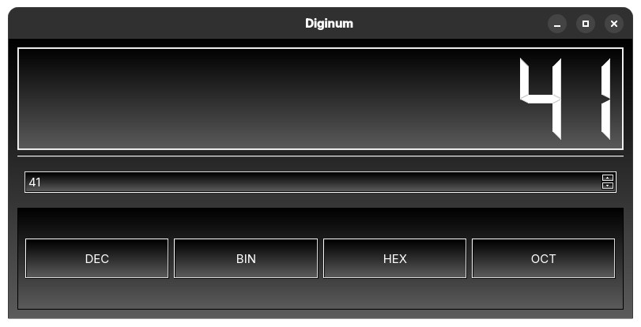

# Diginum
A slightly better version of SandCount that supports more platforms

There's also a TV mode (doesn't really work the best) which is just mobile mode in full screen

# Installation
First install `zenity` using your distro's package manager
Then run:
`curl https://raw.githubusercontent.com/ActuallySandPotNoodles/diginum/refs/heads/main/install.sh | sudo bash`
You might have to logout and then log back in again for it to show up as an option in you application menu.

# Build
`pyinstaller --onefile main.py`

Then

`pyinstaller --onefile sand-setplat.py`

After that, you can manually move both (in the dist folder) of the files you get from this to `/usr/bin`

Then get the icon file from here and put it in `/usr/share/sandpotnoodles`

And get the desktop file and place it in `/usr/share/applications`
